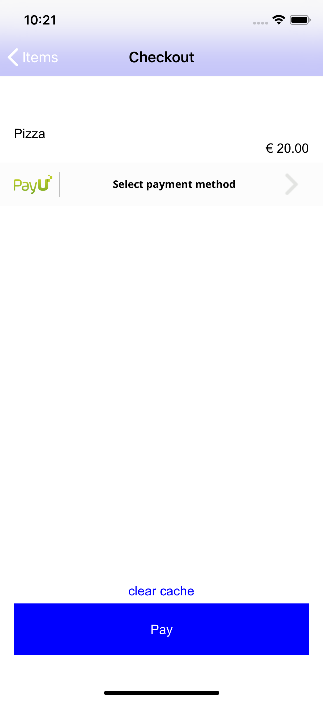
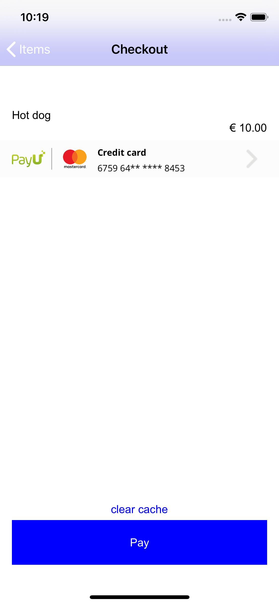
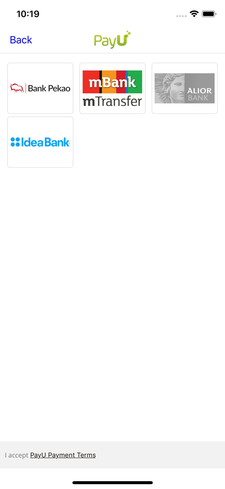
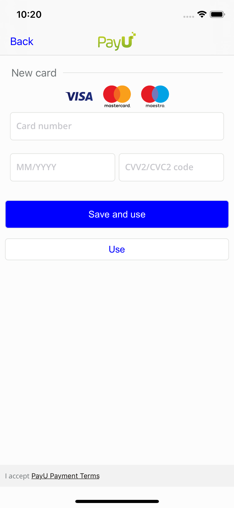
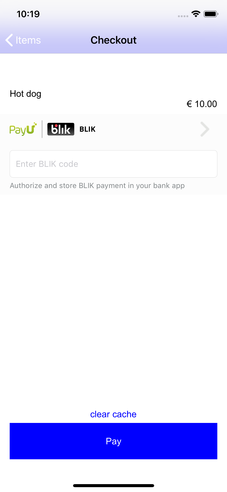
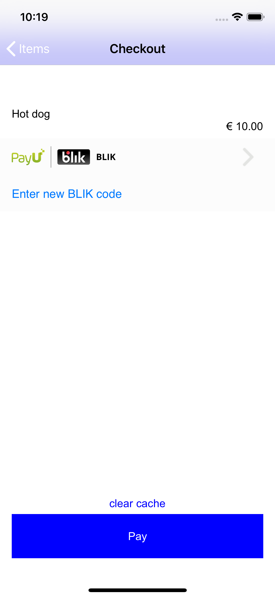
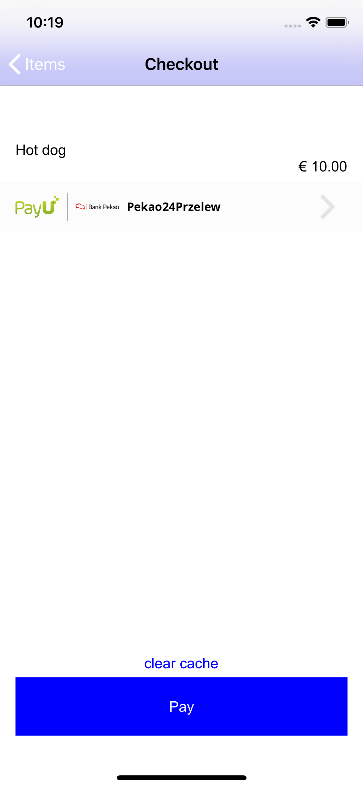
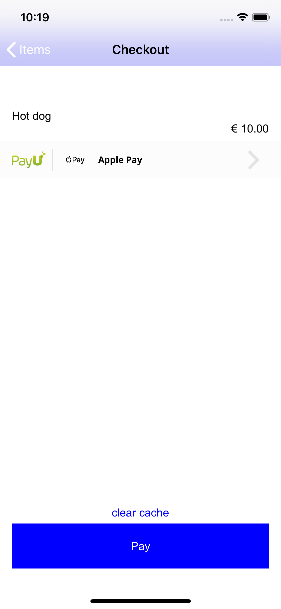

# PayU-iOS-SDK-demo

This application is an example of how to use PayU SDK Mobile.
You can find out how to integrate a payment selector widget in your app and how to proceed with different payment types.

Note, in the demo code there are no networking requests but only locally hardcoded data and simulated conditions.
When implementing your networking client, make use of REST API documentation: https://developers.payu.com/en/restapi.html

Get more details in PayU iOS SDK Mobile documentation files attached to the library file.

# Table of Contents

* [Overview](#overview)
* [Payment Flow](#payment)
* [FAQ](#faq)

## Overview

## Payment Flow
**We suggest that this [flow](http://developers.payu.com/en/mobile_sdk.html) should happend on checkout screen in mobile application**

1. Ensure user has selected any payment method
2. Check which method is selected

**2.1 BLIK code**

2.1.1 Ensure there is a valid code in textfield
2.1.1.1 When Blik code is invalid, show error
2.1.2 Ask your networking service to create order request (OCR) with given data
2.1.3 Payment completed, present success or failure

**2.2 BLIK token**

2.2.0 If user tapped "Enter new BLIK code", isBlikAuthorizationCodeRequired is set. Handle this case like BLIK code.
2.2.0.1 Ensure there is a valid code in textfield
2.2.0.1.1 When Blik code is invalid, show error
2.2.0.2 Ask your networking service to create order request (OCR) with given data
2.2.0.3 Payment completed, present success or failure

2.2.1 Ask your networking service to create order request (OCR) with given data
2.2.2 If blik alternatives exists, present them in PUBlikAlternativesViewController. Set the delegate.
2.2.2.1 Ask your networking service to continue payment with selected blik alternative
2.2.2.2 Payment completed, present success or failure
2.2.3 Payment completed, present success or failure

**2.3 PBL, PEX**

2.3.1 Ask your networking service to create order request (OCR) with given data
2.3.2 Prepare PUWebAuthorizationViewController object reference
2.3.3 Create a proper PUWebAuthorizationViewController object
2.3.4 Present authorizationController - user will continue payment in webview. Set the delegate.
2.3.5 Payment completed, present success or failure

**2.4 Card token**

2.4.1 Ask your networking service to create order request (OCR) with given data
2.4.2 If there is a CVV authorization challange, authorize it using refReqId and cvvAuthorizationHandler
2.4.2.1 Payment completed, present success or failure
2.4.3 If there is a 3ds authorization challange, prepare and present PUWebAuthorizationViewController. Set the delegate
2.4.3.1 If there is a CVV authorization challange, authorize it using refReqId and cvvAuthorizationHandler (note: cvv authorization challenge can appear as a part of 3ds authorization as well)
2.4.3.2 Payment completed, present success or failure

**2.5 Apple Pay**

2.5.1 Create PUApplePayTransaction object with your data
2.5.2 Create PUApplePayHandler object and assign a delegate
2.5.3 Authorize transaction with applePayHandler.
2.5.4 (in delegate method) Ask your networking service to create order request (OCR) with given data
2.5.5 Payment completed, present success or failure

## FAQ

**What kind of payments SDK is supporting?**

PBL, Card, BLIK, Apple Pay

**What kind of currency we are supporting?**

For Apple Pay: EUR, USD, GBP, PLN, CZK, RON, HUF, HRK, SEK, NOK, DKK  for other payments we are supporting all currencies that PayU is supporting

**Where can I download SDK?**

You can find the latest version here: https://drive.google.com/drive/folders/1OxjmEIUbB2Q1HippHw-2Dal9FwNnqwE0

**Where is mobile documentation?**

You can find the mobile SDK documentation here: https://drive.google.com/drive/folders/1OxjmEIUbB2Q1HippHw-2Dal9FwNnqwE0

**What kind of OS version is supported?**

iOS 10.0 +
